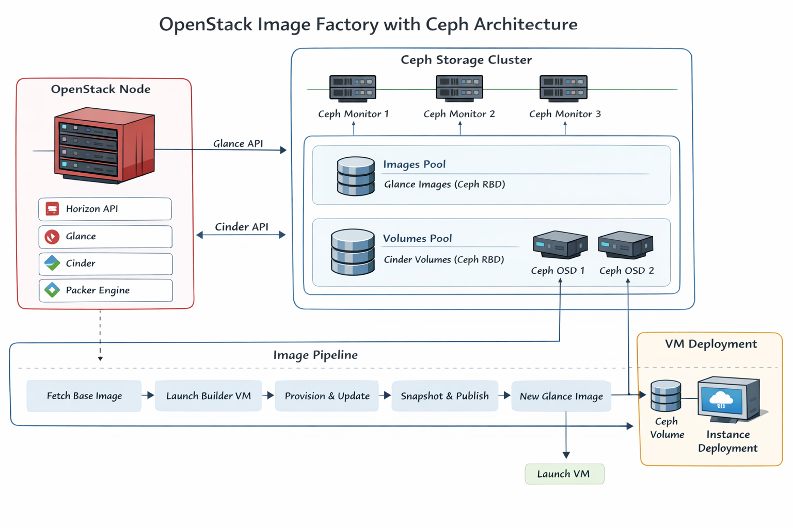

# High-Level Architecture

This document describes the infrastructure architecture of the **OpenStack Image Factory Automation System**.

The system is designed to automate operating system image preparation and distribution inside an OpenStack environment backed by Ceph distributed storage.

---

## System Architecture Diagram



# Architecture Objective

The architecture enables automated creation and management of **golden images** that can be used for reliable VM deployment.

The design separates responsibilities across several infrastructure components:

- OpenStack control and orchestration
- Ceph distributed storage
- Image build automation
- VM deployment

This separation allows the system to scale while keeping image management consistent and automated.

---

# Infrastructure Components

The lab environment consists of the following major components.

## OpenStack Node
* gelani-lab-1

Responsibilities:

- DevStack deployment
- OpenStack control services
- Image management via Glance
- Block storage orchestration via Cinder
- VM lifecycle management via Nova
- Execution of the Packer automation pipeline

This node also acts as the **image factory control point**.

---

## Ceph Storage Cluster

The system uses a distributed Ceph cluster as the storage backend.

| Node | Role |
|-----|------|
| gelani-mon-1 | Ceph Monitor |
| gelani-mon-2 | Ceph Monitor |
| gelani-mon-3 | Ceph Monitor |
| gelani-osd-1 | Ceph Object Storage Daemon |
| gelani-osd-2 | Ceph Object Storage Daemon |

The cluster provides resilient distributed storage for both images and VM volumes.

---

# Ceph Storage Layout

Two Ceph pools are used in the system.

| Pool | Used By | Purpose |
|-----|--------|--------|
| images | Glance | Stores VM images |
| volume | Cinder | Stores VM boot volumes |

Glance images are stored as **RBD objects inside the `images` pool**.

When a user launches a VM with a Ceph-backed volume type, the VM disk is stored in the **`volume` pool**.

This design allows OpenStack to leverage Ceph's distributed storage and snapshot capabilities.

---

# Image Build Pipeline Architecture

The image factory operates through an automated pipeline.

### Step 1 — Base Image Registration

A base upstream cloud image (for example Ubuntu cloud image) is uploaded to **Glance**.

This image acts as the **source image** for the automation pipeline.

---

### Step 2 — Packer Builder VM

Packer launches a **temporary build instance** in OpenStack.

Characteristics of the builder instance:

- created from the base image
- connected to the OpenStack private network
- assigned a floating IP for SSH access
- provisioned automatically

---

### Step 3 — Automated Provisioning

The builder VM performs automated configuration tasks:

- system update and security patching
- package installation
- configuration adjustments
- cloud-init validation

Provisioning scripts ensure the image becomes a **production-ready golden image**.

---

### Step 4 — System Cleanup

Before image publication, the system performs cleanup operations:

- remove temporary files
- clear logs
- reset machine-id
- clean cloud-init state
- remove transient system artifacts

This ensures that each VM launched from the image starts with a clean state.

---

### Step 5 — Image Snapshot

Once preparation is complete:

- the builder VM is stopped
- OpenStack creates a snapshot of the instance
- the snapshot becomes a new **Glance image**

The image is stored in the **Ceph `images` pool**.

---

### Step 6 — Image Publication

The new image is published with metadata such as:

- operating system
- version
- build method
- image tags
- build timestamp

This image becomes available for VM creation.

---

# VM Deployment Architecture

When users deploy a VM using the generated image, the process works as follows.

### Step 1 — User selects image

The user selects a golden image from Glance.

---

### Step 2 — Cinder boot volume creation

If the user selects a Ceph-backed volume type:

- Cinder creates a volume in the **Ceph `volume` pool**
- the volume is populated using the selected Glance image

---

### Step 3 — Nova instance creation

Nova attaches the boot volume to a new instance.

---

### Step 4 — VM boot

The instance boots from the Ceph-backed volume.

The VM starts with:

- updated OS
- working cloud-init
- clean system state
- production-ready configuration
---

# High-Level Architecture Diagram

                 ┌─────────────────────────┐
                 │   Upstream Cloud Image  │
                 │  (Ubuntu / Debian etc.) │
                 └─────────────┬───────────┘
                               │
                               ▼
                    ┌──────────────────────┐
                    │       Glance         │
                    │   Base Image Store   │
                    └──────────┬───────────┘
                               │
                               ▼
                     ┌──────────────────┐
                     │   Packer Build   │
                     │    Pipeline      │
                     └────────┬─────────┘
                              │
                              ▼
                    ┌───────────────────┐
                    │ Temporary Builder │
                    │       VM          │
                    └────────┬──────────┘
                             │
                             ▼
                   Provision + Cleanup
                             │
                             ▼
                    ┌───────────────────┐
                    │  Snapshot Image   │
                    │   (Golden Image)  │
                    └────────┬──────────┘
                             │
                             ▼
                      Glance Image
                             │
                             ▼
               Stored in Ceph RBD (images)
                             │
                             ▼
                     User VM Deployment
                             │
                             ▼
              Ceph Volume Pool (VM disks)


---

# Architectural Benefits

The architecture provides several advantages.

### Automation

Image creation is fully automated, eliminating manual image preparation.

### Consistency

Every image build follows the same repeatable pipeline.

### Storage Efficiency

Ceph RBD provides scalable distributed storage for images and volumes.

### Cloud Experience

Users receive updated and ready-to-use operating system images.

---

# Summary

The high-level architecture integrates:

- OpenStack compute and orchestration
- Ceph distributed storage
- automated image generation using Packer

Together these components form a **fully automated OpenStack image factory** capable of producing and distributing updated cloud operating system images.
---

# About the Architecture Diagram

The ASCII diagram above is **good for GitHub Markdown**, but for a **professional repository** I recommend also adding a **visual diagram**.

Best options:

* **draw.io**
* **Excalidraw**
* **Lucidchart**

We can create something like:

```
Upstream Image
      │
      ▼
   Glance
      │
      ▼
   Packer
      │
      ▼
 Builder VM
      │
      ▼
Provision + Cleanup
      │
      ▼
 Golden Image
      │
      ▼
   Ceph RBD
      │
      ▼
User VM
```

Saved as:

```
assets/diagrams/high-level-architecture.png
