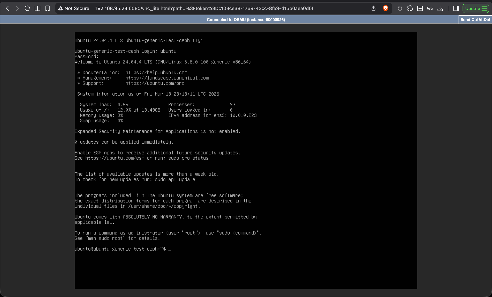
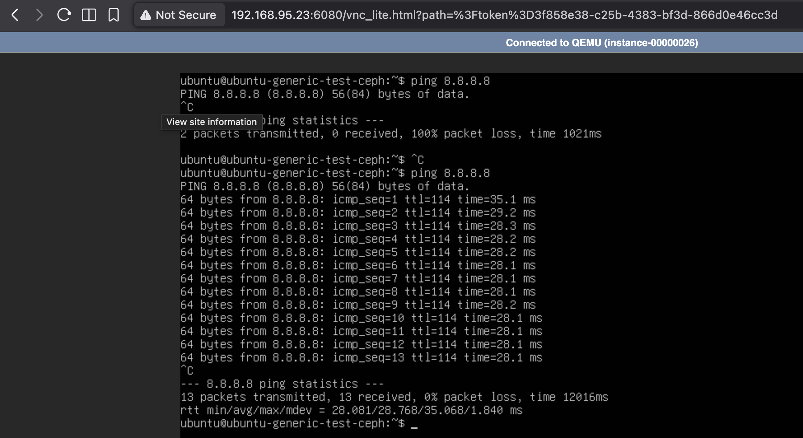

# Phase 1 — Ubuntu 24.04 Golden Image Automation

## Phase Status

Completed

---

# Phase Objective

The goal of Phase 1 was to design and implement the **first working version of the OpenStack Image Factory pipeline**.

This phase focused on automating the creation of a **golden Ubuntu 24.04 image** that can be used for virtual machine deployment in OpenStack.

The phase validates the fundamental concept of the project:

Automated image creation → published to Glance → stored in Ceph → used to deploy VMs.

---

# Problems Addressed

This phase addresses two major operational problems commonly seen in OpenStack environments.

## Manual Image Management

Administrators typically perform the following tasks manually:

- download upstream cloud images
- upload images to Glance
- boot a test VM
- install updates and packages
- recreate a new image

This workflow is slow and difficult to scale.

## Outdated VM Images

Users expect freshly updated operating system images similar to those provided by public cloud providers.

Without automation, VM images quickly become outdated and require manual patching after boot.

---

# Phase Architecture

The first phase introduces a basic automated image build pipeline.

```

Base Image (Glance)
│
▼
Packer Launches Builder VM
│
▼
Provision System
│
▼
Cleanup Image State
│
▼
Snapshot Instance
│
▼
Publish Golden Image
│
▼
Store in Ceph RBD
│
▼
User VM Deployment

```

This pipeline produces updated images that are ready for immediate VM deployment.

---

# Infrastructure Used

The lab environment consists of the following nodes.

## OpenStack Node

```

gelani-lab-1

```

Responsibilities:

- DevStack deployment
- OpenStack services
- Packer execution
- VM orchestration
- image management

---

## Ceph Cluster

| Node | Role |
|-----|------|
| gelani-mon-1 | Ceph Monitor |
| gelani-mon-2 | Ceph Monitor |
| gelani-mon-3 | Ceph Monitor |
| gelani-osd-1 | Ceph OSD |
| gelani-osd-2 | Ceph OSD |

Storage pools used:

| Pool | Purpose |
|-----|--------|
| images | Glance image backend |
| volume | Cinder volume backend |

---

# Implementation Steps

The Phase 1 implementation involved the following steps.

## Step 1 — Base Image Preparation

An upstream Ubuntu cloud image was uploaded to Glance.

Example:

```

ubuntu-24.04-base

```

This image acts as the **starting point for the automation pipeline**.

---

## Step 2 — Packer Template Creation

A Packer template was created to define the image build process.

Location:

```

packer/ubuntu-24.04.pkr.hcl

```

The template defines:

- base image
- builder VM configuration
- network configuration
- security groups
- provisioning scripts
- cleanup scripts

---

## Step 3 — Provisioning Script

The provisioning script prepares the operating system.

Location:

```

scripts/provision-ubuntu.sh

```

Tasks performed:

- update package index
- apply system upgrades
- install required packages
- configure services
- install cloud utilities

Example operations:

```

apt update
apt dist-upgrade
install qemu-guest-agent
install cloud-init utilities
enable ssh service

```

---

## Step 4 — Cleanup Script

The cleanup script prepares the system to become a reusable image.

Location:

```

scripts/cleanup-ubuntu.sh

```

Tasks performed:

- remove temporary files
- clean cloud-init cache
- reset machine-id
- clear system logs

Example operations:

```

cloud-init clean
truncate logs
reset machine-id

```

---

# Image Build Workflow

The automated image creation process follows this workflow.

```

Packer Build Start
│
▼
Create Builder VM
│
▼
Attach Floating IP
│
▼
Provision System
│
▼
Cleanup Image State
│
▼
Stop Builder VM
│
▼
Snapshot Instance
│
▼
Create New Glance Image
│
▼
Delete Builder VM

```

The final result is a new golden image stored in Glance and Ceph.

---

# Example Generated Image

Example image generated during Phase 1:

```

ubuntu-24.04-2026-03-10-1724

```

Metadata example:

```

os_distro = ubuntu
os_version = 24.04
build_method = packer
purpose = golden-image

```

Tags:

```

ubuntu
24.04
golden
automated

```

---

# Validation Tests

After building the image, validation tests were performed.

## Test 1 — Image Presence in Glance

```

openstack image list

```

Confirmed that the new golden image was successfully registered.

---

## Test 2 — Ceph Storage Verification

```

rbd ls -p images

```

Confirmed that the image was stored in the Ceph images pool.

---

## Test 3 — Boot Volume Creation

A boot volume was created from the generated image using the Ceph-backed volume type.

```

openstack volume create --image <image-id> --type ceph

```

---

## Test 4 — VM Boot Test

A virtual machine was launched from the generated image.

```

openstack server create

```

The instance booted successfully.

---

## Test 5 — System Verification

Inside the VM:

```

cat /etc/os-release
uname -r
cloud-init status
apt list --upgradable

```

Results confirmed:

- Ubuntu 24.04 LTS
- cloud-init completed successfully
- SSH service running
- no pending system updates

---

# Validation Outcome

The automated pipeline successfully produced a clean and updated operating system image.

Key results:

- automated image creation succeeded
- VM deployment from generated image succeeded
- system configuration verified
- storage integration confirmed

This validates the feasibility of the automated image factory approach.

---

# Phase Conclusion

Phase 1 successfully demonstrated the core concept of the OpenStack Image Factory.

The system can now:

- automatically build operating system images
- publish them to OpenStack
- store them in Ceph
- deploy virtual machines from those images

This establishes the foundation for further automation and lifecycle management in future phases.

---

# Next Phase

Phase 2 will introduce structured **image release management**, including:

- version aliasing
- image promotion
- rollback capability
- naming standardization
```

## Execution Logs

Detailed command outputs and build logs can be found here:

[View execution logs](../../terminal-log/gelani-lab-1.md)

## Network Issue Debugging

Initial networking issue encountered when launching VM from image:



After applying NAT fix:



---
