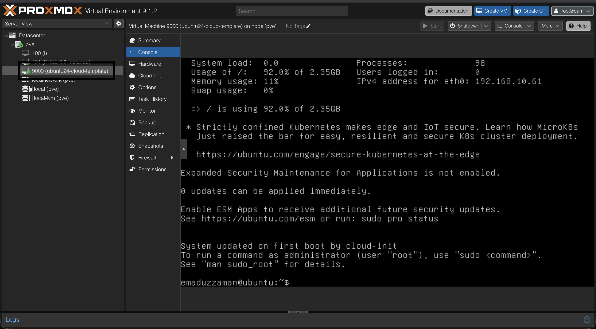

# Template Creation (Ubuntu 24.04)  on Proxmox VE

## Project Overview

This guide documents the complete process of creating an Ubuntu 24.04 (Noble Numbat) cloud-init template on Proxmox VE. The template enables rapid VM deployment with pre-configured settings and automated provisioning.

---

## Project Goals

- Create a reusable Ubuntu 24.04 cloud template
- Enable automated VM provisioning with cloud-init
- Configure user credentials and network settings
- Implement automated system updates on first boot

---

## System Requirements

- **Proxmox VE** (tested on latest version)
- **Storage:** local-lvm (or your preferred storage)
- **Network:** Bridge interface (vmbr0)
- **RAM:** Minimum 2GB for template
- **CPU:** 2 cores minimum

---

## Components Used

| Component | Details |
|-----------|---------|
| **VM ID** | 9000 |
| **Template Name** | ubuntu24-cloud-template |
| **OS Image** | Ubuntu 24.04 Noble Server Cloud Image |
| **Storage Backend** | local-lvm |
| **Network Bridge** | vmbr0 |
| **Memory** | 2048 MB |
| **CPU Cores** | 2 |

---

## Step-by-Step Implementation

### Step 1: Define Variables

Set up environment variables for consistent configuration:

```bash
VMID=9000 
VMNAME="ubuntu24-cloud-template"
STORAGE="local-lvm"
BRIDGE="vmbr0"
CORES=2
MEMORY=2048
IMAGE_URL="https://cloud-images.ubuntu.com/noble/current/noble-server-cloudimg-amd64.img"
IMAGE_FILE="/root/noble-server-cloudimg-amd64.img"
```

### Step 2: Download Ubuntu Cloud Image

Navigate to root directory and download the official Ubuntu 24.04 cloud image:

```bash
cd /root
wget -O "$IMAGE_FILE" "$IMAGE_URL"
```

**Download Statistics:**
- Image Size: 597.36 MB
- Download Speed: ~9.46 MB/s
- Total Time: 63 seconds

### Step 3: Verify Downloaded Image

Check the downloaded file:

```bash
ls -lh "$IMAGE_FILE"
```

Expected output:
```
-rw-r--r-- 1 root root 598M Dec  6 19:14 /root/noble-server-cloudimg-amd64.img
```

### Step 4: Create Virtual Machine

Create the VM with basic configuration:

```bash
qm create $VMID \
  --name $VMNAME \
  --memory $MEMORY \
  --cores $CORES \
  --net0 virtio,bridge=$BRIDGE \
  --agent 1
```

**Configuration Details:**
- Enables QEMU guest agent for better integration
- Uses VirtIO network driver for optimal performance
- Connects to default bridge network

### Step 5: Import Cloud Image to VM

Import the downloaded disk image to Proxmox storage:

```bash
qm importdisk $VMID "$IMAGE_FILE" $STORAGE
```

**Import Process:**
- Creates logical volume: `vm-9000-disk-0`
- Transfers 3.5 GB of data
- Progress tracked from 0% to 100%
- Disk assigned as `unused0` initially

### Step 6: Attach and Configure Disk

Attach the imported disk as SCSI device:

```bash
qm set $VMID --scsihw virtio-scsi-pci --scsi0 $STORAGE:vm-$VMID-disk-0
```

Set boot order to use the attached disk:

```bash
qm set $VMID --boot order=scsi0
```

### Step 7: Add Cloud-Init Drive

Create cloud-init configuration drive:

```bash
qm set $VMID --ide2 $STORAGE:cloudinit
```

**Result:**
- Creates `vm-9000-cloudinit` logical volume
- Attached as IDE CD-ROM device
- Generates cloud-init ISO automatically

### Step 8: Configure Cloud-Init Basic Settings

Set user credentials and network configuration:

```bash
qm set $VMID \
  --ciuser emaduzzaman \
  --cipassword "1234" \
  --ipconfig0 ip=dhcp
```

**Settings Applied:**
- Username: `emaduzzaman`
- Password: `1234` (for initial access)
- Network: DHCP-enabled

### Step 9: Create Custom Cloud-Init Configuration

Create directory and custom cloud-init file:

```bash
mkdir -p /var/lib/vz/snippets
nano /var/lib/vz/snippets/ubuntu24-custom.yaml
```

**Cloud-Init Configuration Content:**

```yaml
#cloud-config

ssh_pwauth: true
disable_root: true

users:
  - name: emaduzzaman
    groups: sudo
    shell: /bin/bash
    sudo: ALL=(ALL) NOPASSWD:ALL
    lock_passwd: false

chpasswd:
  list: |
    emaduzzaman:1234
  expire: False

package_update: true
package_upgrade: true
package_reboot_if_required: true

runcmd:
  - apt-get autoremove -y
  - apt-get autoclean -y
  - echo "System updated on first boot by cloud-init" > /etc/motd
```

**Configuration Features:**
- SSH password authentication enabled
- Root login disabled for security
- User added to sudo group with NOPASSWD
- Automatic package updates on first boot
- System cleanup commands
- Custom MOTD message

### Step 10: Apply Custom Cloud-Init Configuration

Link the custom configuration to the VM:

```bash
qm set $VMID --cicustom "user=local:snippets/ubuntu24-custom.yaml"
```

### Step 11: Start the Template VM

Start the VM for initial boot and cloud-init execution:

```bash
qm start $VMID
```

The system will:
1. Generate cloud-init ISO
2. Boot the VM
3. Execute cloud-init configuration
4. Update packages
5. Apply all custom settings

---

## Screenshots


*Screenshot showing the Ubuntu 24.04 cloud template running in Proxmox VE with noVNC console logged in*

---

## Verification Steps

After the VM starts, verify the setup:

1. **Check VM Status:**
   ```bash
   qm list
   ```

2. **Access Console:**
   - Use Proxmox web interface
   - Open noVNC console
   - Login with credentials: `emaduzzaman` / `1234`

3. **Verify Cloud-Init:**
   ```bash
   cloud-init status
   cat /etc/motd
   ```

4. **Check Network:**
   ```bash
   ip addr show
   ```

---

## Converting to Template

Once verified, convert the VM to a template:

```bash
qm template $VMID
```

**Note:** After conversion, the VM cannot be started directly. Clone it to create new VMs.

---

## Creating VMs from Template

To deploy new VMs from this template:

```bash
qm clone 9000 <NEW_VMID> --name <NEW_VM_NAME> --full
```

Example:
```bash
qm clone 9000 101 --name ubuntu-web-server --full
```

---