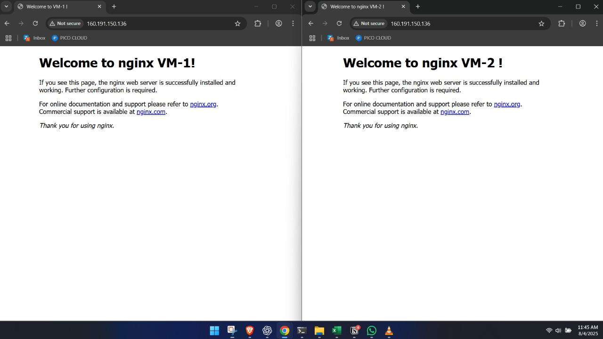

# Load-Balancing-on-Pico-Public Cloud-AmphoraV2

### Step-by-Step Setup of Layer 4 & Layer 7 Load Balancing Using the Default Pico Cloud Load Balancer

This project demonstrates how I deployed two Ubuntu VMs on **Pico Public Cloud**, configured them with **nginx**, and then used the default **AmphoraV2 Load Balancer** to distribute both SSH and HTTP traffic between them.

The load balancer uses a **Floating IP** to expose services externally, and the backend VMs respond alternately using **Round Robin**.

A screenshot is included below showing how the **same IP displays different HTML responses** like *"Welcome from vm-1"* and *"Welcome from vm-2"*.

---

## Screenshot: HTTP Load Balancing Result



---

# Architecture Overview

```
                      ┌────────────────────────────┐
                      │      External Internet     │
                      └────────────┬───────────────┘
                                   │
                                   ▼
                     ┌────────────────────────────┐
                     │   Floating IP (Elastic IP) │
                     │        160.191.150.136     │
                     └────────────┬───────────────┘
                                  │
                                  ▼
                     ┌────────────────────────────┐
                     │ Load Balancer: AmphoraV2   │
                     │ Name: load-balancer-test   │
                     │ Subnet: net-1              │
                     └────────────┬───────────────┘
                                  │
              ┌───────────────────┼───────────────────┐
              │                                       │
    ┌─────────▼────────┐                  ┌───────────▼─────────┐
    │ Listener: lis-ssh│                  │ Listener: lis-http  │
    │ Protocol: TCP/22 │                  │ Protocol: HTTP/80   │
    └─────────┬────────┘                  └───────────┬─────────┘
              │                                       │
    ┌─────────▼────────┐                  ┌───────────▼─────────┐
    │ Pool: pool-ssh   │                  │ Pool: pool-http     │
    │ Algorithm: RR    │                  │ Algorithm: RR       │
    └─────────┬────────┘                  └───────────┬─────────┘
              │                                       │
  ┌───────────▼────────────┐              ┌───────────▼────────────┐
  │ Member: vm-1           │              │ Member: vm-1           │
  │ IP: 192.168.10.101     │              │ IP: 192.168.10.101     │
  └───────────┬────────────┘              └───────────┬────────────┘
              │                                       │
  ┌───────────▼────────────┐              ┌───────────▼────────────┐
  │ Member: vm-2           │              │ Member: vm-2           │
  │ IP: 192.168.10.102     │              │ IP: 192.168.10.102     │
  └────────────────────────┘              └────────────────────────┘

```

---

# Step-By-Step Configuration

## Login & Accessing Compute

- Logged into Pico Cloud
- Navigated to **Compute → Instances**
- Goal: Deploy two VMs for testing (HTTP + SSH)

---

## Network Configuration

**Network Name:** `net-1`

**Subnet:** `192.168.10.0/24`

**Gateway:** Enabled (→ `192.168.10.1`)

**DNS:** `8.8.8.8`

**DHCP Pool:** `192.168.10.2 - 192.168.10.254`

---

## Router Configuration

**Router Name:** `router`

**SNAT:** Enabled

**External Network:** `public-fir-pool-01`

Internal interface added → `192.168.10.1`

***Note:** Enables outbound internet access from VMs using SNAT.*

---

## VM Creation & Setup

Created two Ubuntu VMs:

| VM | OS | Private IP | Purpose |
| --- | --- | --- | --- |
| vm-1 | Ubuntu 18.04 | 192.168.10.101 | nginx backend |
| vm-2 | Ubuntu 18.04 | 192.168.10.102 | nginx backend |

### Step 1: Connect to Each VM via SSH

```bash
# Connect to vm-1
ssh ubuntu@192.168.10.101

# Connect to vm-2
ssh ubuntu@192.168.10.102

```

> Replace ubuntu with your VM username if different.
> 
> 
> If using the **floating IP via the load balancer**, you can test after configuring listeners and pools.
> 

---

### Step 2: Update the System

```bash
sudo apt update -y
sudo apt upgrade -y
```

This ensures the system packages are up-to-date.

---

### Step 3: Install nginx

```bash
sudo apt install nginx -y
```

Enable nginx to start on boot:

```bash
sudo systemctl enable nginx
sudo systemctl start nginx
sudo systemctl status nginx
```

---

### Step 4: Edit the Default HTML Page

The default web page for nginx is located at:

```
/var/www/html/index.html
```

Edit it with `nano` (or `vi`) to customize the message:

```bash
# For vm-1
sudo nano /var/www/html/index.html
# Add:
# <h1>Welcome from vm-1</h1>

# For vm-2
sudo nano /var/www/html/index.html
# Add:
# <h1>Welcome from vm-2</h1>
```

After editing, reload nginx:

```bash
sudo systemctl reload nginx
```

---

### Step 5: Verify Web Pages

Open your browser and navigate to the **floating IP** of the load balancer:

```
http://160.191.150.136
```

- You should see **different messages** alternating between vm-1 and vm-2 because of load balancing.

---

**Security Group: `sec-1`**

- Allowed:
    - TCP 22 (SSH)
    - TCP 80 (HTTP)
    - ICMP (Ping)

---

## Floating IP Allocation

Allocated Floating IP:

```
160.191.150.136
```

Attached this to the Load Balancer later.

---

## Load Balancer Setup

Created an **AmphoraV2** Load Balancer:

- Name: `load-balancer-test`
- Subnet: `net-1`
- Admin State: Enabled

---

## Listener Creation

Created two listeners:

| Listener | Protocol | Port |
| --- | --- | --- |
| lis-ssh | TCP | 22 |
| lis-http | HTTP | 80 |

Listeners act as entry points.

---

## Attach Floating IP

Attached the FIP `160.191.150.136`

→ Now reachable from the internet.

---

## Pool Configuration

Two pools configured:

| Pool | Protocol | Algorithm | Session Persistence |
| --- | --- | --- | --- |
| pool-ssh | TCP | Round Robin | None |
| pool-http | HTTP | Round Robin | None |

---

## Adding Pool Members

Added vm-1 and vm-2 to both pools using:

- `192.168.10.101`
- `192.168.10.102`

This creates backend targets for the LB.

---

# Testing the Load Balancer

## ✔ SSH Test

Repeated multiple SSH attempts:

```
ssh ubuntu@160.191.150.136
```

Result:

- First login → vm-2
- Next login → vm-1
- Alternates via Round Robin

---

## ✔ HTTP Test

Installed nginx and deployed simple HTML pages:

**vm-1:**

```
Welcome from vm-1
```

**vm-2:**

```
Welcome from vm-2
```

Opened the same IP:

```
http://160.191.150.136
```

Results alternated → Verified HTTP load balancing.

---