# Short Guide to Change the Default RDP Port on Windows Systems

This guide will walk you through changing the default RDP port 3389 to a custom port and then allowing that port in the inbound firewall rule.

---

## STEP 01: Change the Default RDP Port

### Step 01.1
Press the **Windows key** and search for **"Registry Editor"**

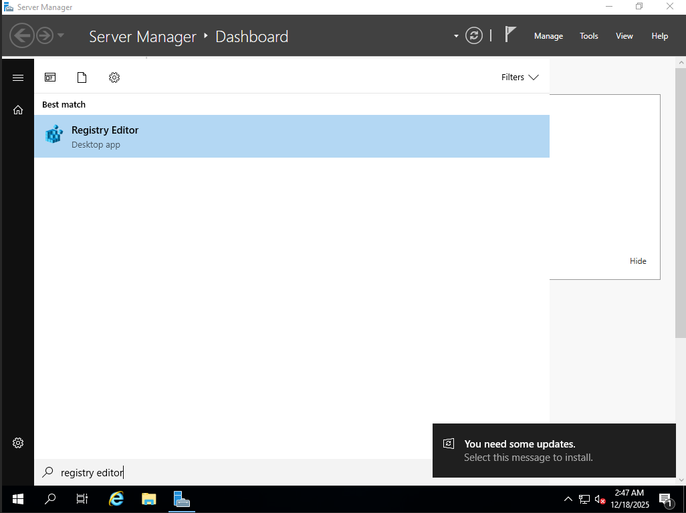

### Step 01.2
Navigate to the following registry path:

```
HKEY_LOCAL_MACHINE\System\CurrentControlSet\Control\Terminal Server\WinStations\RDP-Tcp
```
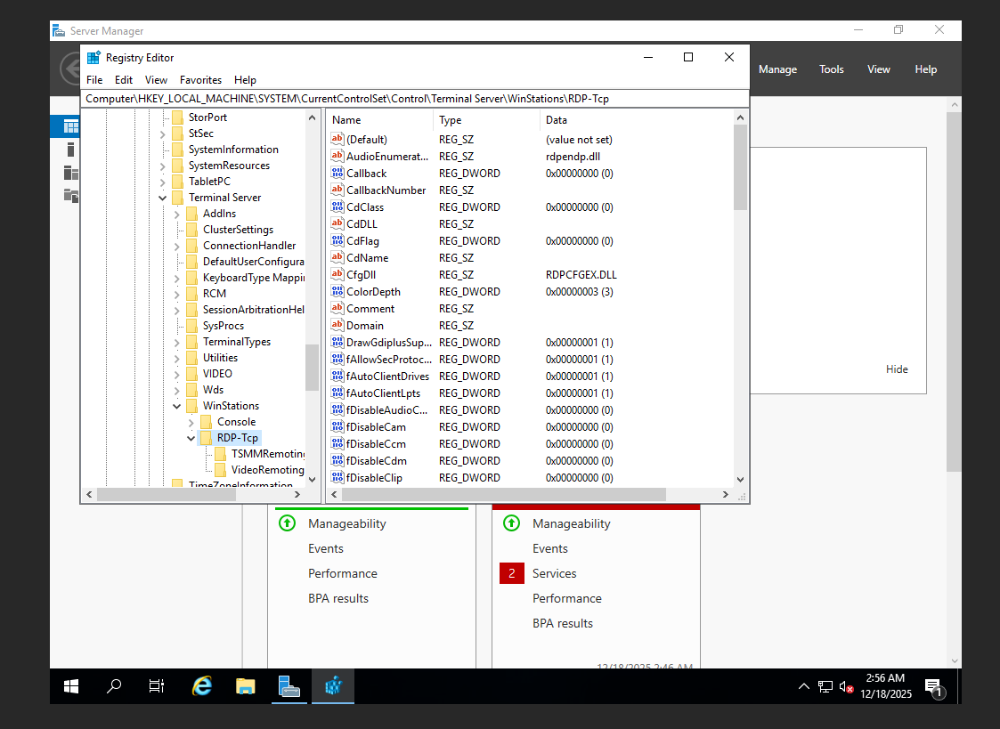

### Step 01.3
Scroll down and find the key named **PortNumber**

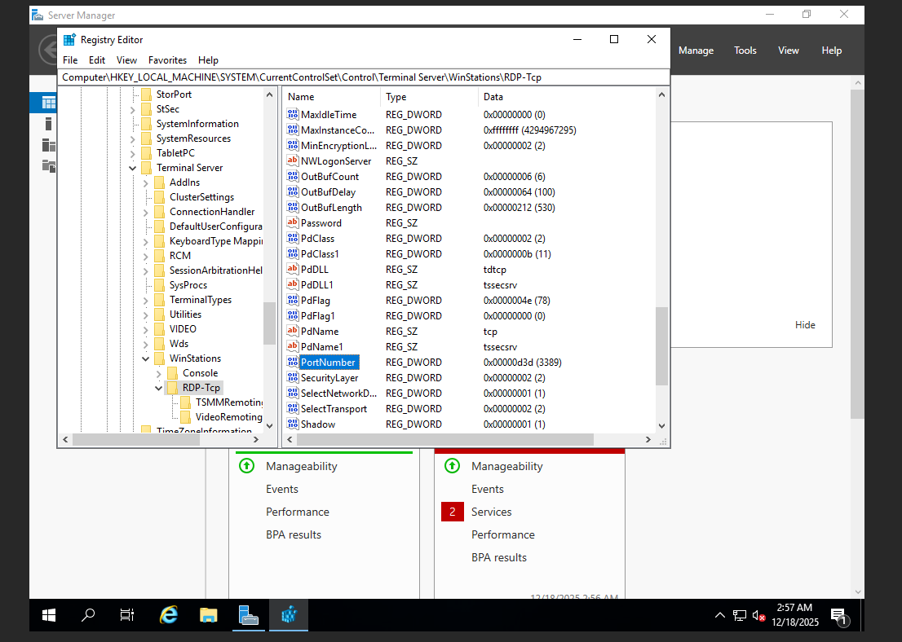

### Step 01.4
Double-click **PortNumber**

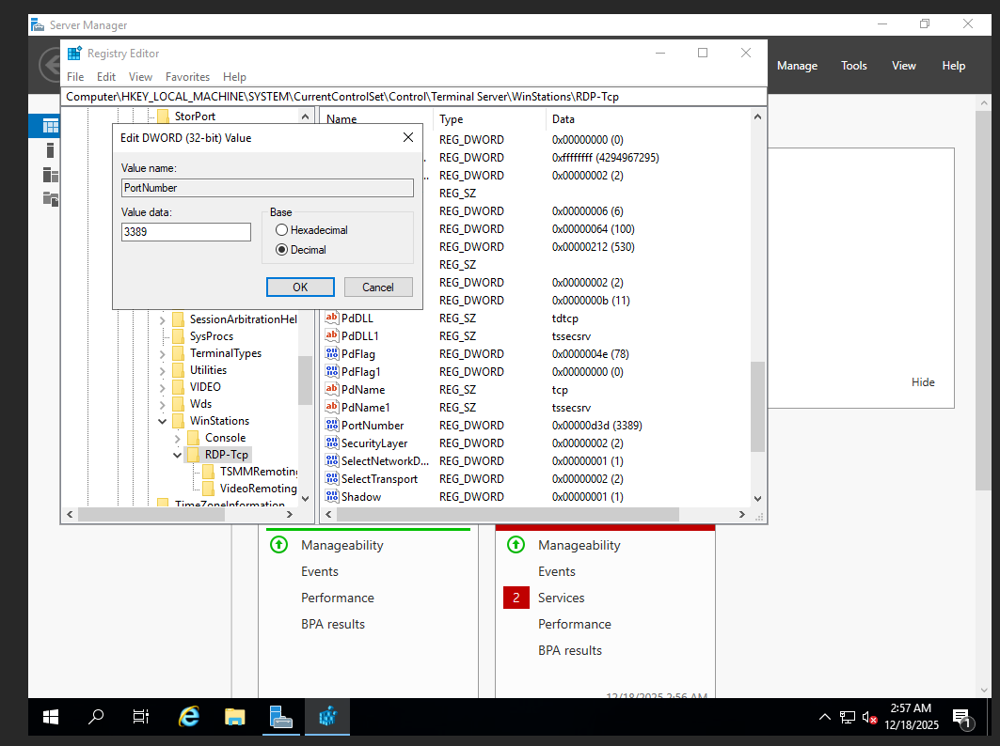

### Step 01.5
**Important:** Select **Decimal** (not Hexadecimal)

1. Type the new port: `50465` (see note below about port selection)
2. Click **OK**

> **📌 Choosing a Safe Port Number:**
> 
> **Recommended Port Range:** `49152 - 65535` (Dynamic/Private Ports)
> 
> This range is designated for private or dynamic use and is generally safe from conflicts with well-known services.
> 
> **Example:** `50465` (used in this guide)
> 
> **Avoid these ranges:**
> - `0 - 1023`: Well-known ports (HTTP, HTTPS, FTP, etc.)
> - `1024 - 49151`: Registered ports (used by various applications)
> 
> You can choose any port in the `49152-65535` range, such as:
> - `50001`, `51234`, `55555`, `60000`, etc.

---
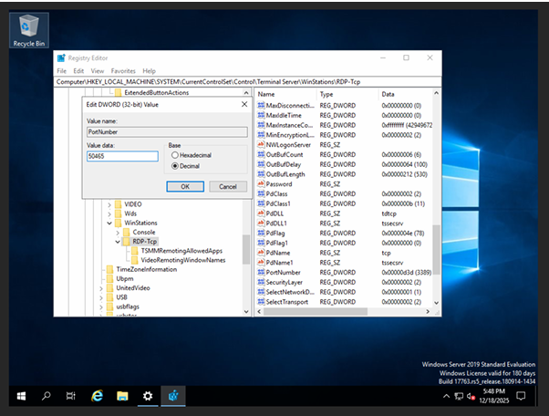

## STEP 02: Allow the Custom Port in the Firewall

### Step 02.1
Press the **Windows key** and search for **"Windows Defender Firewall with Advanced Security"**
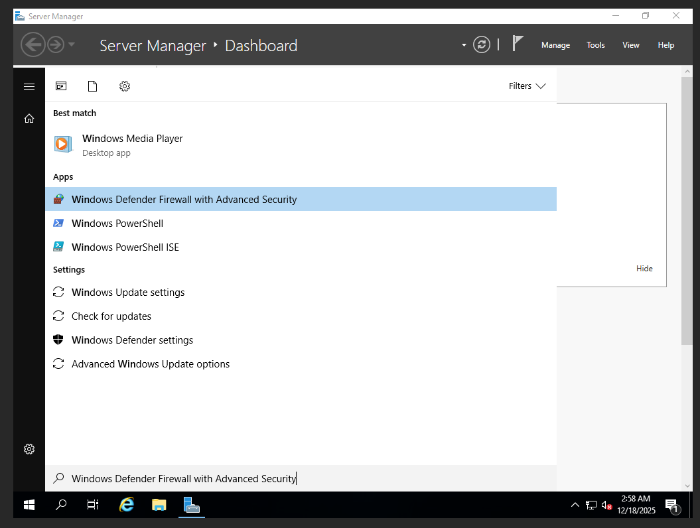

### Step 02.2
Click **Inbound Rules** in the left panel

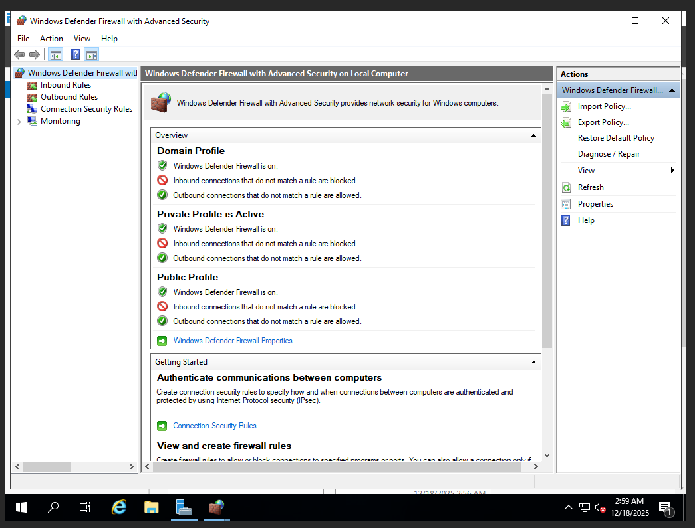

### Step 02.3
Click **New Rule** in the right panel

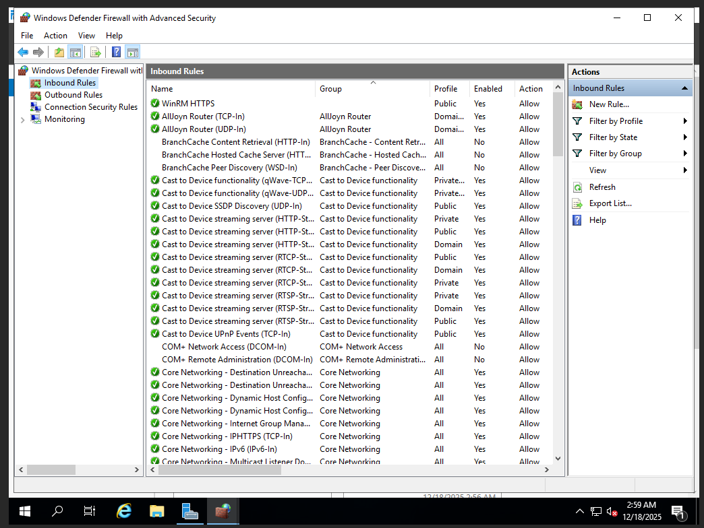


### Step 02.4
**Rule Type:** Select **Port** → Click **Next**

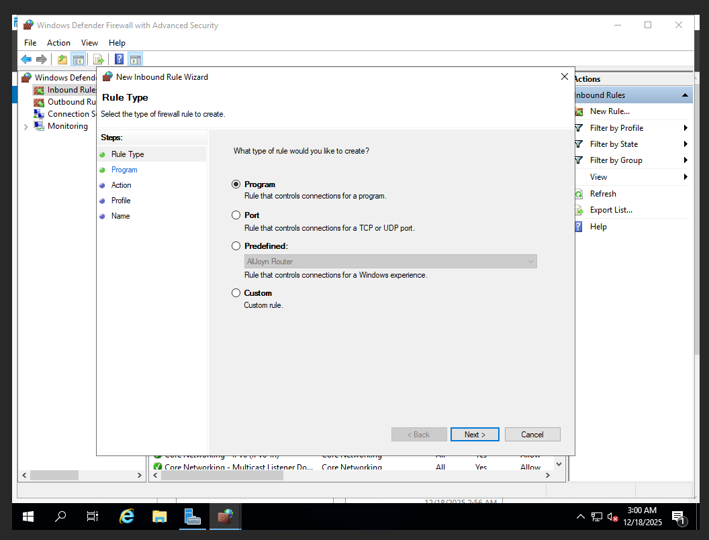

### Step 02.5
Configure the port settings:

1. Select **Specific local ports**
2. **Protocol:** Select **TCP**
3. **Ports:** `50465` (or your chosen port from the safe range `49152-65535`)

Click **Next**

### Step 02.6
Select **Allow the connection** → Click **Next**

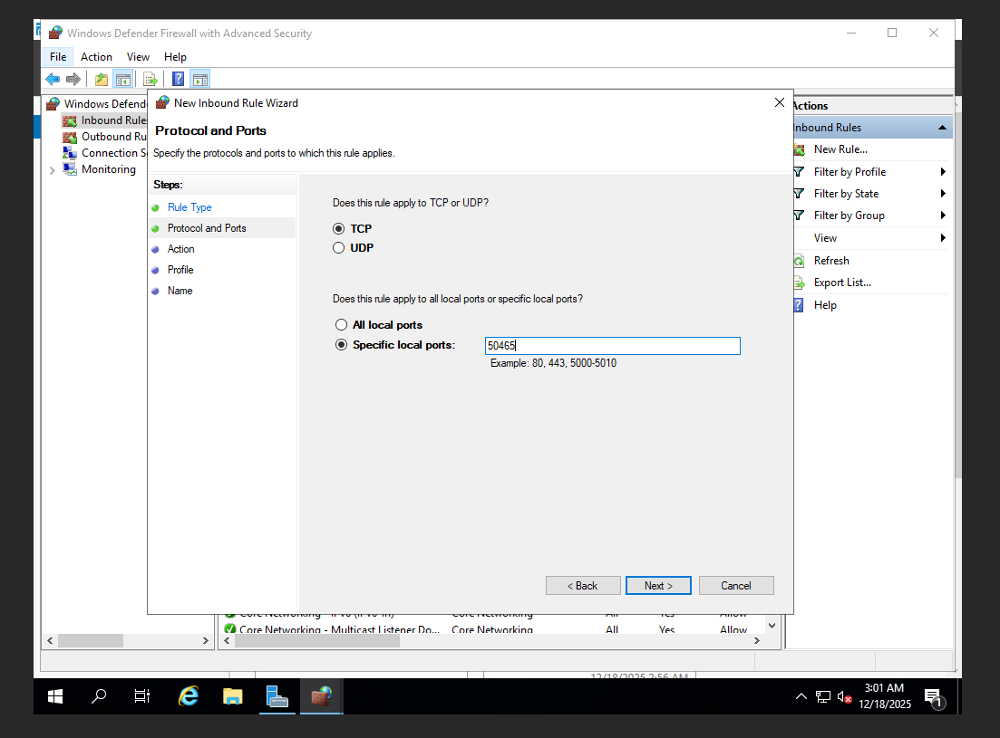

### Step 02.7
**Profile:** Check all boxes (Domain, Private, Public) → Click **Next**

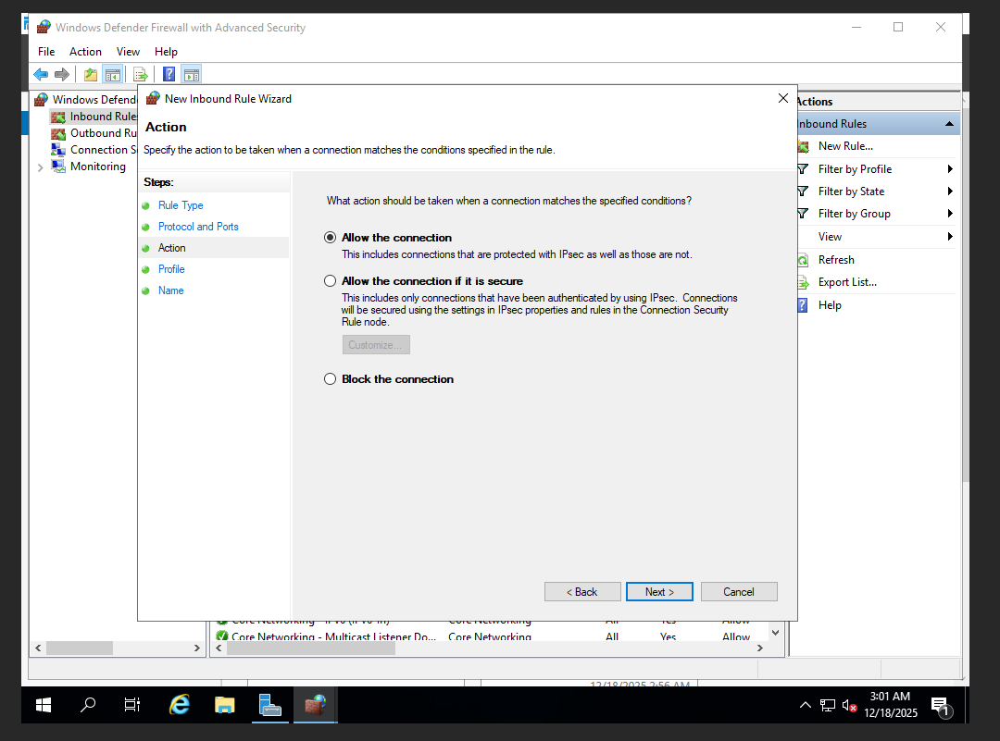

### Step 02.8
**Name:** Type a descriptive name like `RDP-Custom-50465` → Click **Finish**

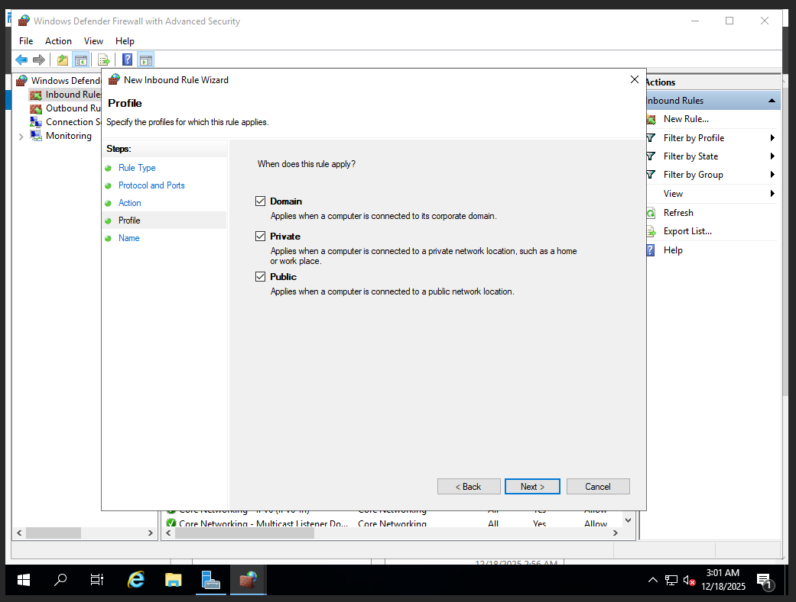


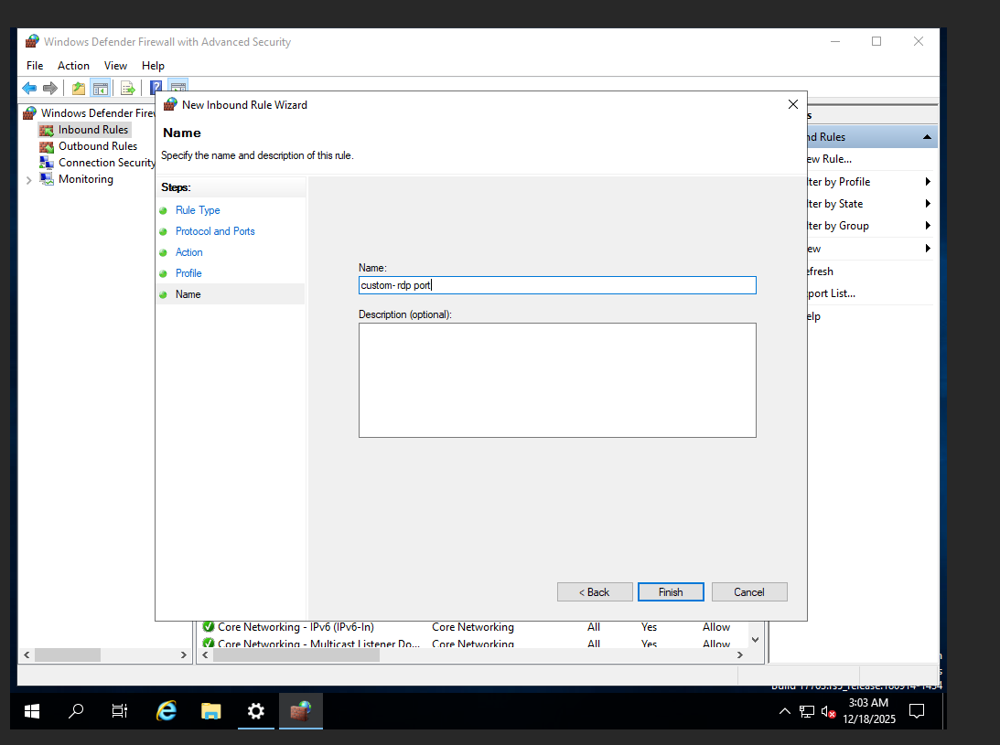
---

## Configuration Complete

- Changed the RDP port from 3389 to 50465
- Created a firewall rule to allow connections on the new port

**Note:** need to restart the Remote Desktop service or reboot the system for changes to take effect.

---

## Connecting with the New Port

When connecting via RDP, use the following format:

```
Example: Computer: 192.168.1.100:50465
```